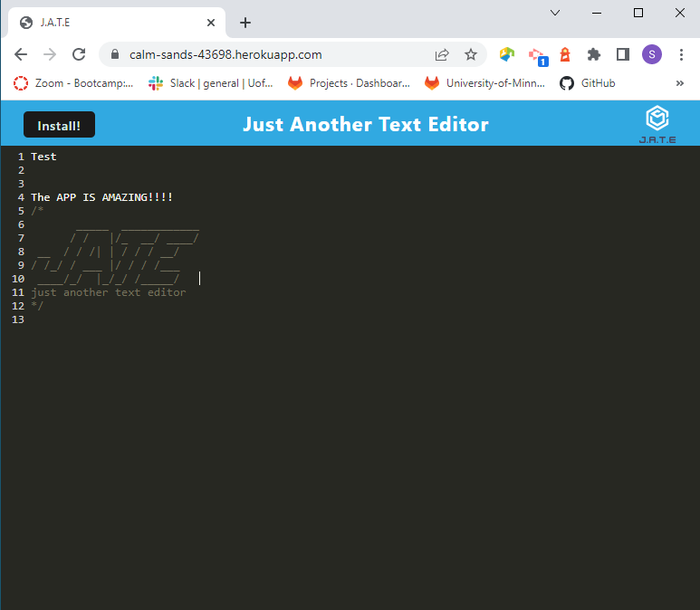

# PWA-TextEditor
Your task is to build a text editor that runs in the browser. The app will be a single-page application that meets the PWA criteria. Additionally, it will feature a number of data persistence techniques that serve as redundancy in case one of the options is not supported by the browser. The application will also function offline.
## Description

The PWA text editor is essentially a notepad that can store data in the local browser - when you leave the page and come back the data persists and repopulates

The notepad can be downloaded and the data will persist online as well as offline.

The project was relatively straightforward, there were a couple sticking points but overall very helpful and a good time to work through.

## Table of Contents (Optional)

- [Installation](#installation)
- [Usage](#usage)
- [Credits](#credits)
- [License](#license)

## Installation

There is no installation necessary to launch the app - you can access the app at https://calm-sands-43698.herokuapp.com/

If you open the script you will have to run an npm i to get the correct packages.

## Usage

Login to the site https://calm-sands-43698.herokuapp.com/ and begin writing your notes.  If you have anything you need to remember, write it down and when you return to the site the data will return.

Feel free to checkout the links:  
GitHub Profile: https://github.com/swmcguire 
GitHub Code:  https://github.com/swmcguire/PWA-TextEditor  
Heroku Live: https://calm-sands-43698.herokuapp.com/ 

## Credits

Module 19 Class Work - Specifically the mini project  
TA - Emma Olson - helped with the launch and console.logs

## License

MIT License

Copyright (c) 2023 swmcguire

Permission is hereby granted, free of charge, to any person obtaining a copy
of this software and associated documentation files (the "Software"), to deal
in the Software without restriction, including without limitation the rights
to use, copy, modify, merge, publish, distribute, sublicense, and/or sell
copies of the Software, and to permit persons to whom the Software is
furnished to do so, subject to the following conditions:

The above copyright notice and this permission notice shall be included in all
copies or substantial portions of the Software.

THE SOFTWARE IS PROVIDED "AS IS", WITHOUT WARRANTY OF ANY KIND, EXPRESS OR
IMPLIED, INCLUDING BUT NOT LIMITED TO THE WARRANTIES OF MERCHANTABILITY,
FITNESS FOR A PARTICULAR PURPOSE AND NONINFRINGEMENT. IN NO EVENT SHALL THE
AUTHORS OR COPYRIGHT HOLDERS BE LIABLE FOR ANY CLAIM, DAMAGES OR OTHER
LIABILITY, WHETHER IN AN ACTION OF CONTRACT, TORT OR OTHERWISE, ARISING FROM,
OUT OF OR IN CONNECTION WITH THE SOFTWARE OR THE USE OR OTHER DEALINGS IN THE
SOFTWARE.

---
